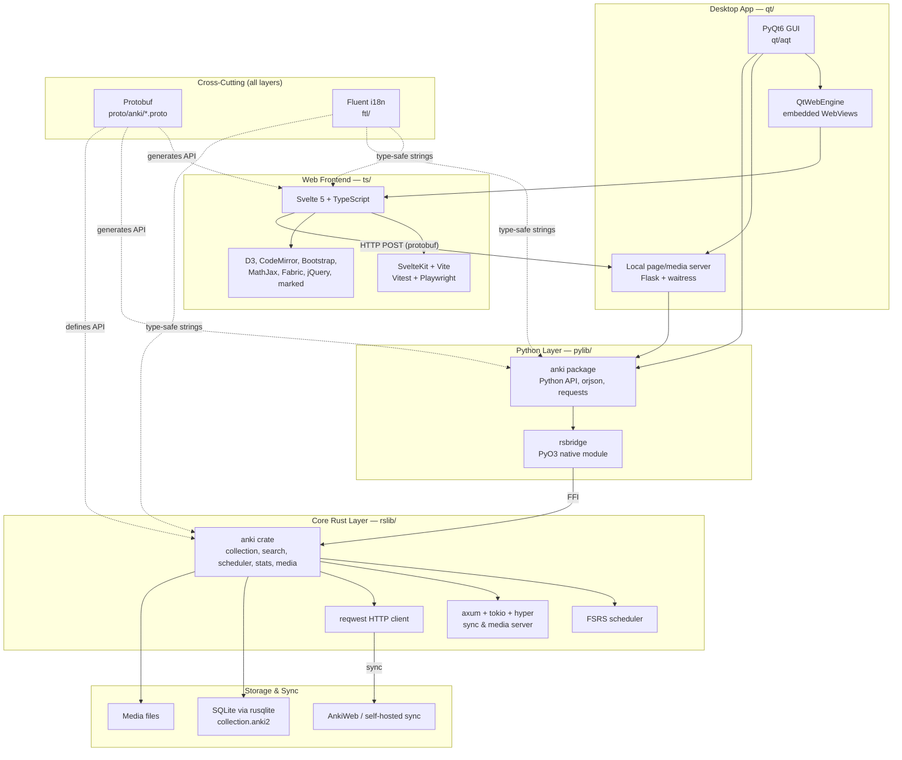
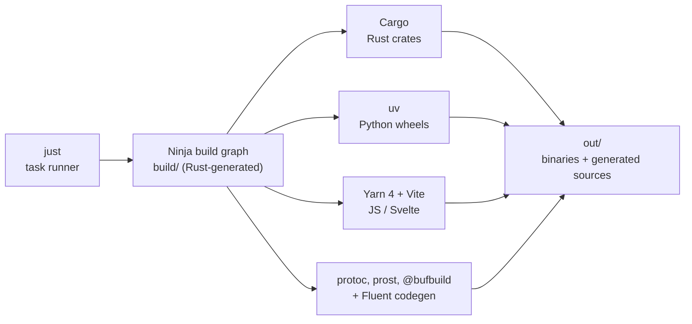

# ReadyMCAT — a desktop + mobile study app for the **MCAT**, built inside the Anki engine

ReadyMCAT is a fork of [Anki](https://apps.ankiweb.net) turned into a study app for the **MCAT** (the Medical College Admission Test). It is not a plugin or add-on — the changes live in Anki's own Rust engine, Python/Qt desktop app, Svelte/TypeScript front end, and a new iOS companion, so the desktop and phone share one engine. The full product rationale is in [`../ReadyMCAT-PRD.md`](../ReadyMCAT-PRD.md) and the research behind it in [`../brainlift-mcat.md`](../brainlift-mcat.md).

### What this fork adds on top of Anki

- **Points-at-stake review order (the Rust engine change).** A new `ReviewCardOrder::PointsAtStake` variant plus a `rslib/src/points_at_stake/` module orders due cards by `topic_weight × student_weakness` (AAMC exam weight × how weak the student is in that topic, aggregated from FSRS recall). Why this belongs in Rust, and the upstream files it touches with a per-file merge-difficulty estimate, are in **[docs/readymcat-points-at-stake.md](./docs/readymcat-points-at-stake.md)**.
- **Honest-memory dashboard.** A per-topic memory score shown as a range with a give-up rule (no score until ≥200 graded reviews and ≥50% outline coverage), plus a coverage map — `ts/routes/readymcat-dashboard/`.
- **Teach-on-miss reviewer.** On a missed question the reviewer runs that card's authored guiding-sub-question ladder instead of flipping to the answer — `ts/reviewer/` (`mcq.ts`, `fr.ts`, `passage.ts`, `teach_on_miss.ts`) + `qt/aqt/reviewer.py`.
- **Pre-loaded multi-format question bank.** 1,075 original, source-cited cards (414 discrete MCQ, 410 free-response/type-in, 174 AAMC-style passage questions, and 77 CARS questions) auto-provisioned into four decks on first launch with no import — `readymcat/content/`, built by `readymcat/tools/build_question_bank.py`, provisioned by `qt/aqt/readymcat_provision.py`.
- **First-launch diagnostic.** A short quiz that seeds a per-topic prior for ordering (never a shown score) — `rslib/src/diagnostic/` + `ts/routes/readymcat-diagnostic/`.
- **Home / study hub.** The app's entry screen — four one-tap format tiles with honest (child-excluding) due counts, a "what to study next" shortcut, a diagnostic call-to-action, and lightweight progress — `ts/routes/readymcat-home/` + `qt/aqt/readymcat_home.py` (JSON endpoint `readymcatHomeStatus`, backed by the pure `readymcat/tools/home_launcher.py`). Merges in alongside these docs from the `readymcat-home-hub` branch.
- **iOS companion.** A SwiftUI app driving the shared Rust core through a new `rsios` C-ABI (`RsiosFFI.xcframework`), running a real review loop — in the engine's **default** queue order (points-at-stake is a desktop-side ordering) — on the iOS Simulator — `ios/`, `rsios/`. See **[ios/README.md](./ios/README.md)**.

### Build & run (both apps)

**Desktop** (macOS/Linux/Windows): `just run` (or `just run-optimized`). No import step — the MCAT bank pre-loads on first launch. Build the (unsigned) macOS `.dmg` installer with `./tools/build-installer`. Full dev setup: [docs/development.md](./docs/development.md).

**iOS** (Simulator): run `ios/scripts/build-rust.sh` to cross-compile the Rust core into `RsiosFFI.xcframework`, then `ios/scripts/run-sim.sh` (or open `ios/ReadyMCAT.xcodeproj` in Xcode) and run on the iOS Simulator — no signing required. Details in [ios/README.md](./ios/README.md).

### Content, licensing & credits

ReadyMCAT is released under **AGPL-3.0-or-later**, the same license as Anki, which it forks and gratefully credits (some upstream Anki components are BSD-3-Clause); see [LICENSE](./LICENSE). The bundled question content is 100% original, grounded in free/open sources (OpenStax CC BY, LibreTexts) with per-item citations, and is licensed CC BY-SA 4.0. The app makes **no runtime model calls** — the bank is statically authored, source-cited content shipped with the app. The optional community "Aidan" MCAT deck that `taxonomy.json` can also map is credited to its community author and used for educational purposes only. More on the content pipeline: [readymcat/README.md](./readymcat/README.md).

---

The remainder of this file documents the **upstream Anki** engine that ReadyMCAT builds on.

## About

Anki is a spaced repetition program. Please see the [website](https://apps.ankiweb.net) to learn more.

## Architecture (upstream Anki base)

Anki is a multi-layered, polyglot application: a core **Rust** library, a **Python**
library with a **PyQt6** desktop GUI, and a **Svelte/TypeScript** web frontend, tied
together with **Protobuf** (cross-language API/IPC) and **Fluent** (type-safe
translations). ReadyMCAT's additions (above) layer onto this same structure — the
points-at-stake order and diagnostic live in the Rust core, the dashboard/reviewers/diagnostic
in the Svelte front end, provisioning in the Qt layer, and the iOS companion drives the
same Rust core through the `rsios` C-ABI.

### Build & Tooling

See [docs/architecture.md](./docs/architecture.md) for a full description of how the
layers communicate.

## Getting Started

### Contributing

Want to contribute to Anki? Check out the [Contribution Guidelines](./docs/contributing.md).

For more information on building and developing, please see [Development](./docs/development.md).

#### Contributors

The following people have contributed to Anki: [CONTRIBUTORS](./CONTRIBUTORS)

### Anki Betas

If you'd like to try development builds of Anki but don't feel comfortable
building the code, please see [Anki betas](https://betas.ankiweb.net/).

## License

Anki's license: [LICENSE](./LICENSE)
