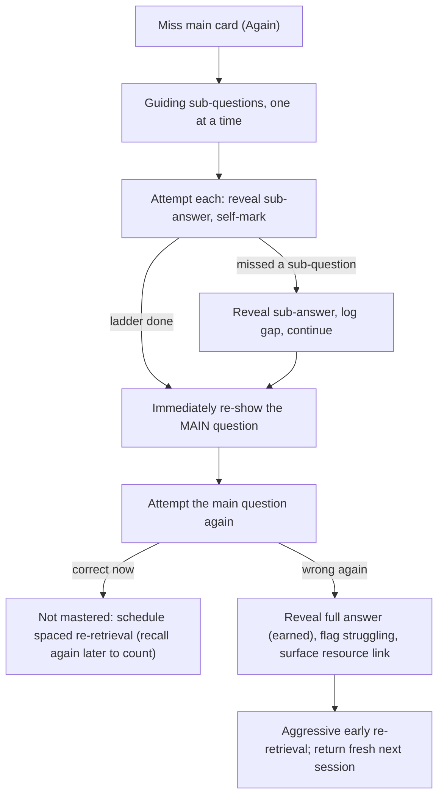
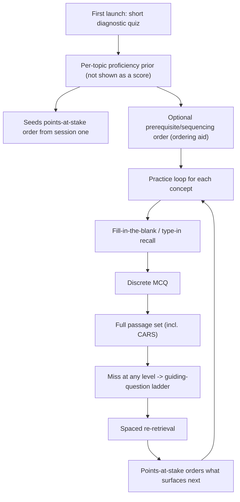
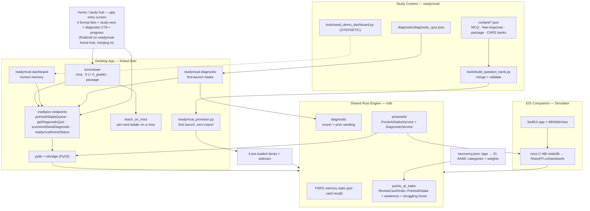

This application is a desktop and mobile study app titled ReadyMCAT.

# ReadyMCAT — Product Requirements Document

## OVERVIEW

ReadyMCAT is a desktop and mobile study app for the MCAT, built inside the Anki codebase rather than as a plugin, add-on, or external API. It starts from one observation about how students actually fail. When you get a question wrong and the app simply shows you the correct answer, you read the explanation, feel like you "get it," and move on. That feeling is the trap: passively reading a correct answer manufactures a sense of _understanding_ that the student mistakes for _readiness_, and hours later, when the same concept comes back, they get it wrong again. Every major question bank — UWorld, Blueprint, Kaplan — delivers wrong-answer explanations as static text, so every major tool reinforces this illusion.

ReadyMCAT's core feature is the opposite of "here's the answer." When you miss, it does **not** hand you the explanation. It breaks the question into smaller guiding sub-questions that make you retrieve your way to the answer (active retrieval, not passive reading), and then it forces the corrected concept back through a spaced schedule so the fix actually sticks instead of evaporating by the afternoon. This is the product's reason to exist, and it is the spiky point of view from the brainlift made concrete.

Two supporting ideas protect that core. First, ReadyMCAT refuses to let "understanding" be confused with "readiness": it measures **memory, performance, and readiness as three separate, honest scores** and never shows a number it cannot back up. Second, during a session it answers the only question that matters — "what should I study right now?" — by ordering cards by how many exam points are **at stake** (topic weight × the student's weakness).

The third idea is bigger than flashcards, and it is now built rather than promised: today's student duct-tapes AAMC materials, Anki, and UWorld together because each tool covers only one question format — Anki does flashcard recall, QBanks do discrete MCQs, AAMC does passages — and no single bank lets you practice the same concept across all of them. ReadyMCAT ships **one all-in-one question bank that spans every format the exam uses** — short fill-in-the-blank/type-in recall, discrete MCQs, and full AAMC-style passage sets including CARS — on one engine, with one scheduler and one honest score, replacing that fragmented stack. It is **pre-loaded with zero import**, and a short starting diagnostic personalizes each student's path from the first session (see the all-in-one question bank below). Everything in this document runs **inside the forked Anki engine, on two apps sharing one engine, with one real Rust engine change, and no runtime AI** — the question bank is statically authored, source-cited content shipped with the app, not model output. The spiky "teach-on-miss" idea ships in a **no-model-call form** (authored guiding sub-questions on every bundled question); having the app _generate_ those sub-questions automatically at runtime is deferred (see Out of Scope).

## WHAT IS THE MVP?

The shipped core proves the foundation works end to end on both screens, with the spiky "teach-on-miss" idea visible, not just promised, and it does so with **no runtime AI** — no generated cards, no chatbot, no model calls at study time.

On the desktop, ReadyMCAT is a fork of Anki that builds from source and runs in place. There is **no import step**: on first launch it pre-loads a bundled, 100%-original MCAT question bank straight into the new user's collection — **1,075 cards** across four decks: 414 discrete multiple-choice questions (`ReadyMCAT`), 410 free-response type-in prompts (`ReadyMCAT::Free Response`), 174 AAMC-style passage questions over 36 passages (`ReadyMCAT::Passages`), and 77 CARS questions over 15 passages (`ReadyMCAT::Passages::CARS`). Unlike a classic flashcard where the student self-grades their own recall, every ReadyMCAT card **requires a real input**: you select an option on an MCQ, type an answer on a free-response prompt (auto-graded against accepted answers, key terms, and numeric tolerances), or answer a passage-based MCQ with the passage shown alongside. The student still runs a genuine Anki review loop and FSRS still updates each card's memory state; two things are different — what happens when they miss, and the order the cards arrive in.

When the student misses **any** bundled question, ReadyMCAT does **not** just flip to the answer. It runs a short **teach-on-miss** ladder — the guiding sub-questions authored for that specific card — that walks the student to the answer through their own retrieval, then re-shows the main question and schedules the corrected concept to come back soon and again later, so the correction is re-retrieved on a spaced schedule rather than read once and forgotten. The sub-questions are authored, not model-generated; auto-generating them at runtime is deferred.

The order is set by a new piece of the Rust engine, the **points-at-stake queue**, which ranks due cards by the weight of their topic on the real MCAT multiplied by how weak the student is in that topic — so high-yield, weak topics come first. The first time a student opens the app it offers a short **diagnostic** that seeds each topic's weakness estimate, so that ordering is useful from session one instead of only after hundreds of reviews. That diagnostic opens exactly once; on every launch after that (and whenever it is skipped) the app opens instead to a **home/study hub** — the entry screen, with one-tap tiles for each question format (each showing an honest due count), a "what to study next" shortcut, a diagnostic call-to-action, and lightweight progress — and the launch routing guarantees exactly one of the two opens. After studying, a dashboard shows an **honest memory score**: never a bare number, always a range with a confidence chip, alongside the percent of the official MCAT outline the bank covers, and it shows _nothing_ until there is enough evidence (at least 200 graded reviews and at least 50% topic coverage).

On mobile, a minimal iOS app builds and runs (verified on the iOS Simulator), opens a bundled copy of the collection, and runs a real review session on the _same_ Rust engine — the FSRS grading loop goes through the shared backend, which is the mobile bar and is met. Two things are honestly still desktop-first: the phone reviews a small bundled sample collection in the engine's **default order**, because points-at-stake only activates when the collection selects that review order and a `taxonomy.json` sits beside it — the engine change is compiled into the phone binary, but no bundled taxonomy or deck-config setting exercises it yet (a content/config gap, not an engine gap). The teach-on-miss reviewer and two-way sync are also deferred on iOS.

## TEACH-ON-MISS: THE CORE FEATURE

This is the feature that makes ReadyMCAT different, and it comes straight from the brainlift's spiky point of view. The claim: showing the correct answer after a wrong answer is passive reading, the least effective form of learning. The student reads it, confuses the resulting feeling of understanding with genuine readiness, and fails the same concept later. The fix is not a better explanation — it is to make the student _retrieve_ the correction, and then to make them retrieve it again on a spaced schedule.

This works without any runtime AI. **Every bundled question carries its own authored ladder** of guiding sub-questions, stored in that note's `Subquestions` field, so teach-on-miss fires on every card in the pre-loaded bank rather than a curated subset. When the student answers a bundled question wrong (which the reviewer grades as "Again"), the reviewer intercepts the miss and runs that card's ladder instead of just revealing the back. The original sidecar file (`subquestions.json`, keyed by concept/tag) is retained so the same behavior also works on classic self-graded cards from an optional Aidan-deck import.

**The flow.** The ladder appears one sub-question at a time; for each, the student attempts it, sees the correct sub-answer, and self-marks Got it or Missed. If they miss a sub-question, the app reveals that sub-answer, logs the gap, and continues down the ladder — it never blocks the student or drills deeper than the single pre-authored level. After the last sub-question, the app **immediately re-shows the original main question** so the student attempts it again with the scaffolding fresh. If they get it right now, the concept is still **not** treated as mastered — getting it right seconds after the scaffold is not readiness — so it is scheduled for spaced re-retrieval and must be recalled again in a _later_ session to count. If they get the main question **wrong again**, the app finally reveals the full answer (now earned through real retrieval attempts rather than passive reading), flags the concept as struggling, schedules it for aggressive early re-retrieval, and surfaces the card's existing resource link (for example, the Khan Academy video) as a "needs content review" nudge; it returns fresh in the next session rather than re-looping the same ladder on the spot.

Two principles hold across every branch: the flow always ends gracefully within the session and never traps the student in a loop, and immediate success after the ladder never counts as readiness — the corrected concept (and any missed sub-questions) always go back through spaced re-retrieval, which is the only honest test of whether the correction stuck.

Mechanically, the corrected concept re-enters relearning (Anki already shortens a failed card's interval), it is tagged `ReadyMCAT::struggling`, and its topic weakness rises — so the points-at-stake queue resurfaces it soon and again later. This is built on the **desktop** reviewers (the front end in `ts/reviewer/` — `mcq.ts`, `fr.ts`, `passage.ts` — plus `qt/aqt/reviewer.py`) and runs across the whole bundled bank; the iOS app keeps the basic review session. Exam-style questions in every format (MCQ, type-in, passage, CARS) are already shipped; the one thing explicitly deferred here is having a model _generate_ the ladders automatically at runtime (with source-traceability and an eval).

This is framed honestly as a hypothesis to test, not a proven win. ReadyMCAT instruments the outcome that matters: when a corrected concept returns in a later session, is it recalled correctly more often than concepts where the student simply saw the answer? The full fair test — teach-on-miss on, teach-on-miss off, and plain Anki at equal study time — is still ahead.

## HONEST SCORES: MEMORY, PERFORMANCE, READINESS

The teach-on-miss feature attacks one half of the spiky point of view (passive reading); the honest scores attack the other half (confusing understanding with readiness). ReadyMCAT separates three questions that every other tool blends together. **Memory** is the chance a student recalls a fact right now. **Performance** is the chance they get a new, exam-style question right. **Readiness** is a projected score on the real 472–528 scale, with a range and a statement of confidence. A student can have excellent recall of "the mitochondria is the powerhouse of the cell" and still fail a passage on cellular respiration — which is exactly the gap a single blended "you're 78% ready" number hides.

The shipped build computes and shows **memory only**, and shows it honestly: derived from FSRS's per-card recall probability, aggregated per AAMC topic, always presented as a range (a statistical interval) with a confidence chip, never a bare percentage, alongside the percent of the outline the bank covers. Above all it obeys a give-up rule — no score until at least 200 graded reviews and at least 50% topic coverage. (Those two thresholds are honest-by-intent defaults chosen for the MVP, not values derived from data; they are the knobs the calibration work will tune.) A system that knows when it does not know is more trustworthy than one that always answers. Performance and readiness are deliberately deferred and the app refuses to fake them.

One honest caveat about the range itself, so it is not read as more certainty than it carries: today the interval is the **dispersion of FSRS's per-card recall predictions across a topic's cards** (a ±1.96·SEM spread over cards), _not_ a confidence interval that includes FSRS's own calibration error — which is the larger unknown and exactly what the Brier/calibration work in Success Metrics will quantify. It is also weighted by how many cards a topic has rather than by the topic's AAMC exam weight, so deck composition nudges the headline number. In other words the current range answers "how much do the model's per-card estimates vary," and it will be widened or replaced with a calibration-derived, outline-weighted interval once held-out data exists.

When they arrive, the method is already chosen. **Performance** uses the paraphrase test as its honesty check: for a concept, the student's recall on the card is compared with their accuracy on two reworded, exam-style questions that test the same idea; if performance accuracy tracks recall too closely _across concepts_ — the two move up and down together with no independent signal — then the performance model is likely just re-expressing memory rather than measuring a distinct skill, so that coupling is reported rather than hidden. (The test is about correlation across many concepts, not a single concept's two numbers happening to match, which can coincide by chance.) **Readiness** maps performance onto the real 472–528 scale as a point estimate plus a likely range, annotated with the percent of the exam covered and the main drivers behind the number, and it inherits the same give-up rule — no projection until the evidence supports one.

## THE STUDY LOOP

A session is deliberately familiar, because the review loop is the part of Anki that already works. On the desktop the student lands on the **home/study hub** — the app's entry screen — and taps one of four format tiles (or "what to study next") to begin; then they see one card at a time. On the desktop this uses Anki's reviewer, extended with three question reviewers and teach-on-miss: a bundled card presents an interactive question — pick an MCQ option, type a free-response answer, or answer a passage-based MCQ with the passage shown alongside — and the reviewer **auto-grades the input** into FSRS (correct on the first attempt → Good; anything that needed the teach-on-miss ladder → Again), so the student never has to self-report whether they "got it." On iOS the Swift app asks the shared Rust backend for the next card, renders its HTML in a web view, and sends the grade back. Either way FSRS updates that card's memory state. The two things the student feels are the teach-on-miss ladder on a missed question and the points-at-stake ordering that puts the most valuable, weakest-topic cards first. FSRS still decides _when_ a card is due; the points-at-stake queue decides the _order_ among cards that are already due; teach-on-miss decides what happens on a miss.

## POINTS-AT-STAKE: THE ENGINE CHANGE

ReadyMCAT's required change to Anki's Rust engine is a new review ordering, the points-at-stake queue. For every due card it computes a simple, defensible value:

> points at stake = topic_weight × student_weakness

`topic_weight` is how heavily that card's topic is weighted on the real MCAT, taken from AAMC's published content distribution (a named, traceable source). `student_weakness` is how weak the student currently is in that topic, computed by aggregating their FSRS recall probability across every card in that topic. Cards are ordered so the highest-value, weakest-topic material comes first.

Two honest notes on this definition. First, `student_weakness` is built from FSRS recall probability, which is **memory** — so today's "points at stake" is really _exam weight × memory gap_, not _exam weight × performance/readiness gap_. That is the right proxy while memory is the only score the app can back up, but by the product's own thesis (memory ≠ performance ≠ readiness) the truer points-at-stake will take the performance/readiness gap as its input once those models exist; the queue is designed to swap that input in without changing shape. Second, because the value is computed per topic, every due card in the same topic shares one score, so the queue discriminates sharply _between_ topics but not _within_ one — inside a topic the order falls back to most-overdue-first (then card id). A corrected concept tagged `ReadyMCAT::struggling` is the one exception that jumps its topic-mates, via the 2× boost below.

This belongs in Rust, and it is genuinely new. Anki's scheduler reasons about one card at a time and has no concept of a "topic," no notion of exam value, and no way to aggregate weakness across the cards that make up a concept. Its strongest existing option, "retrievability ascending," sorts due cards purely by how forgotten each one is — never by how much it is worth on the exam. The points-at-stake queue requires topic awareness and exam-value weighting that do not exist anywhere in the engine today; it runs during queue building over the full collection, fast enough for tens of thousands of cards; and because the Rust engine is shared, it ships to both desktop and phone from a single implementation. A Python-only version could not reach the iOS app. It also supports the spaced re-retrieval that teach-on-miss relies on — though, honestly, the main levers there are Anki's relearning (a failed card's interval shortens) and the `ReadyMCAT::struggling` 2× boost, not the topic-weakness shift: one card's recall drop moves a well-studied topic's mean weakness only slightly, so topic weakness is the slow background signal while the tag boost does the immediate resurfacing.

Concretely, the change adds a new `ReviewCardOrder::PointsAtStake` variant (a `+1` enum value on the existing review-order list) wired through `rslib/src/storage/card/mod.rs`, and a new module `rslib/src/points_at_stake/` that parses `taxonomy.json`, aggregates per-topic weakness from FSRS state, and ranks the due review cards; a corrected concept tagged `ReadyMCAT::struggling` gets a `2×` ranking boost so it resurfaces ahead of its peers (ranking only — the honest memory aggregation is never touched). The result is exposed through a **new protobuf service** (`proto/anki/points_at_stake.proto` → `PointsAtStakeService`) so Python (and later Swift) can request the ranked queue plus the per-topic aggregation, memory report, and coverage. It ships with Rust unit tests (path-prefix matching, tag-over-subdeck resolution, weakness aggregation, ranking correctness, the struggling boost, and the empty/untagged-topic edge case) and a Python integration test that calls the new message and checks the order — and it leaves undo working and the collection uncorrupted (the change only reorders the in-memory queue and never mutates cards). A one-page note, `docs/readymcat-points-at-stake.md`, records why this lives in Rust plus the upstream files touched with an honest per-file merge-difficulty estimate.

## TWO APPS, ONE ENGINE

ReadyMCAT is two apps that share one engine, not two projects. The desktop app is a fork of Anki; the phone app is a companion on the same Rust backend. Because the engine is shared, the points-at-stake change is _available_ to the phone from the same implementation and the memory logic would be identical on both — but on iOS it is not yet switched on: the phone reviews a bundled sample in default order, and activating points-at-stake there is a content/config step (bundle a `taxonomy.json` and select the review order), not another engine change. On the desktop, the Python GUI (`qt/aqt`) and the Svelte/TypeScript front end (`ts`) talk to the Rust core through `pylib` and its `rsbridge` binding. On iOS — the hardest part of the build, and the reason to start it on day one — there is no open-source Anki to fork, so ReadyMCAT compiles the Rust core for iOS and drives it from Swift through a thin C interface (the `rsios` C-ABI staticlib packaged as `RsiosFFI.xcframework`). This is built and verified: the SwiftUI app loads a bundled copy of the collection and runs a real review session on the shared engine, on the Simulator. The teach-on-miss reviewer is desktop-first and two-way sync is deferred.

When two-way sync lands, reviews must flow both ways with none lost or double-counted, and a written conflict rule resolves the case where the same card is reviewed on both devices offline: the later review by timestamp wins, while the loser's review-log entry is preserved so history is never silently dropped. That is the next milestone for the phone companion — today it shares the engine but does not yet sync.

## TOPICS, THE DECK, AND COVERAGE

Everything topic-aware rests on one small artifact: a mapping from card tags to the official exam outline. The base study material is the **pre-loaded original bank**, whose every AAMC card is tagged `#ReadyMCAT::AAMC::<category>`. ReadyMCAT includes a `taxonomy.json` that maps those tags onto the **31 AAMC content categories** and assigns each a `topic_weight` from AAMC's published distribution; the same file also maps an optional community "Aidan" deck (`Aidan_.apkg`) — a richly tagged deck the taxonomy still supports for students who want to import it — onto the same categories. That single mapping powers three things: it gives the points-at-stake queue its `topic` and `topic_weight`; it produces the coverage map (the percent of the outline the bank covers) shown on the dashboard and used by the give-up rule; and it lets the memory score be reported per topic. Every bundled question carries its own teach-on-miss ladder, so the feature is not limited to a hand-picked subset. **CARS is deliberately excluded from AAMC scoring**: it is the MCAT's skills section with no content category, so its cards are tagged `#ReadyMCAT::CARS` (no AAMC tag) and are cleanly ignored by the points-at-stake queue, the coverage map, and the dashboard while still being fully studyable. A separate synthetic 50,000-card deck exists only for performance benchmarking and is never presented as study content.

## ALL-IN-ONE QUESTION BANK: EVERY FORMAT, ONE ENGINE

Students bolt QBanks and AAMC materials onto Anki because each tool covers only one question format — Anki does flashcard recall, QBanks do discrete MCQs, AAMC does passages. ReadyMCAT closes that gap: **it ships one bank that spans every format the exam uses**, from short recall up to full passages including CARS — without becoming the wall of text the brainlift argues against. A student works one concept across every format on one engine, rather than being taught content. This is built and pre-loaded with zero import: 414 discrete MCQs, 410 free-response prompts, 174 AAMC passage questions across 36 passages, and 77 CARS questions across 15 passages — 1,075 cards, all original and source-cited, on the same FSRS scheduler and the same points-at-stake order.

**A starting diagnostic defines each student's path.** The first time a student opens ReadyMCAT, the app offers a short diagnostic quiz that samples across the AAMC content categories (a 31-item short mode drawn from a 37-item bank that covers all 31 categories). The output is not a score shown to the student; it is a per-topic proficiency _prior_ the engine uses to personalize everything after it. The scorer turns responses into that prior through a documented method — difficulty-aware evidence, beta-binomial shrinkage toward a baseline, and hierarchical pooling across correlated categories — then seeds each topic's weakness estimate so the points-at-stake order is useful from the very first session instead of only after hundreds of reviews. That seed **decays as real FSRS reviews accumulate** (a precision-weighted blend), so the quiz only ever nudges early ordering. The honesty rule is enforced in code, not just documented: the diagnostic feeds ordering (and coarse prerequisite-placement bands) only, and a guardrail test proves it **never writes the dashboard's memory / performance / readiness scores**. It auto-opens once on first launch and can be retaken any time from **Tools → ReadyMCAT Diagnostic**.

**Practice spans every format.** For a concept, ReadyMCAT lets the student practice it in every form the exam uses: short fill-in-the-blank/type-in recall, discrete MCQs, and full passage-based sets including CARS that demand passage-level reasoning. The student attempts each cold first (productive failure); a miss at any level runs the same guiding-question ladder as teach-on-miss and then schedules spaced re-retrieval. Explanations stay minimal and just-in-time — each item's authored explanation and cited source fill real gaps, and runtime-generated questions are a later enhancement. Points-at-stake decides which concepts surface first, so foundations tend to come before the material built on them; a strict mastery-gated escalation from recall → MCQ → passage is a design goal layered on top of that ordering rather than a hard lock today.

**What's shipped, and what's next.** Shipped: the multi-format question bank (fill-in-the-blank/type-in, discrete MCQ, and full passage-based sets including CARS, on one scheduler); the diagnostic-quiz intake (with coarse prerequisite-placement bands as a lightweight ordering aid, not a second teaching engine); and the **home/study hub** — the app's entry screen, a single launcher (an honest status strip, four one-tap format tiles with due counts, a study-next shortcut over the points-at-stake queue, a diagnostic call-to-action, and lightweight progress), finalized on the `readymcat-home-hub` branch and merging in alongside this document. Because the engine is shared, the bank and diagnostic reach desktop and phone. Still ahead: runtime AI generation of questions and teach-on-miss ladders; two-way desktop–phone sync; and the performance and readiness models.

**Tested, not assumed.** "One bank across every format beats a stitched-together stack" is a hypothesis. The fair test is an ablation at equal study time — escalating multi-format practice on one engine versus plain Anki, and versus a single-format-plus-separate-QBank baseline — measured on passage-level accuracy for concepts first practiced as short recall. A null result is reported honestly.

## USER PERSONA

ReadyMCAT is built for college sophomores and juniors on the pre-med track in North America preparing for the MCAT. They are one to two years from their test date and study around a full course load, in fragmented sessions that move between a desk and a phone between classes. They have finished or are partway through the prerequisite courses — biology, general and organic chemistry, physics, biochemistry, psychology, and sociology — so their content knowledge is real but uneven, with genuine gaps. They are cost-sensitive and gravitate to free Anki and community decks rather than paid courses that run from $99 to $3,600, and they juggle a multi-tool stack (AAMC, Anki, UWorld) whose signals never combine. Their shared frustration is that nothing tells them honestly where they stand, and that getting a question wrong rarely turns into actually learning it.

The first persona is **Jordan, a junior**, in the middle of MCAT prep while taking biochemistry and physics II. Jordan studies one to two hours a day in gaps and is tired of reading explanations that feel obvious in the moment and vanish by the next day. Jordan wants missing a question to _teach_ something, wants scarce time spent on whatever moves the score most, and trusts a tool more when it admits uncertainty than when it shows a confident number.

The second persona is **Priya, a sophomore**, just beginning content review. Priya has large gaps and is overwhelmed by the sheer volume of MCAT content and by not knowing where to start. She wants the app to open to a ready-to-study bank, to tell her what to study first, to show coverage honestly, and — when she gets something wrong — to walk her through it step by step instead of just showing the answer she will forget.

## USER STORIES

These are the stories the shipped build serves:

- As a student who answered wrong, I want to be guided through smaller sub-questions instead of being handed the answer, so that the correction actually sticks and I see it again before I forget it.
- As a new user, I want the app to open to a ready-to-study MCAT bank with no import or setup, so I can start practicing immediately.
- As a student, I want a single home screen that shows my honest status and lets me jump into any format in one tap, so I always know what to do next.
- As a student, I want to answer real questions — pick an MCQ option, type a free-response answer, work an AAMC-style passage or a CARS passage — instead of self-grading a flashcard, so my practice matches the exam.
- As a new user, I want to take a short starting quiz that figures out what I already know, so the app orders my cards well from the very first session.
- As a student working a concept, I want to practice it in every format the exam uses — fill-in-the-blank, discrete MCQ, and full passages including CARS — in one bank, so I do not switch between Anki, a QBank, and AAMC.
- As a junior studying between classes, I want to review the same MCAT bank on my laptop and my phone, so I can study in both contexts without switching tools.
- As a time-strapped pre-med, I want the weakest, highest-yield cards surfaced first, so my limited study time moves my score the most.
- As a student who distrusts vanity metrics, I want my memory score shown as a range with an explicit "not enough data yet" state, so I am never misled into confusing understanding with readiness.
- As a student, I want to see what percent of the official MCAT outline my bank covers, so I know what I am not studying.
- As a sophomore on a budget, I want the app to be free and to work offline, so I am not paying for multiple subscriptions.
- As a student, I want reviews to be fast and never freeze, so studying feels smooth.

These stories describe where the product is going next (built on the same foundation):

- As a student, I want the app to _generate_ the guiding sub-questions automatically for any card I miss, so teach-on-miss covers imported decks too, not just the bundled bank.
- As a student, I want to move up to harder formats (recall → MCQ → passages) only after I have shown mastery at the level below, so I practice in the right order.
- As a student, I want a performance score that reflects whether I can _apply_ a concept on a novel exam-style question, not just recall it, so I know I can perform.
- As a student, I want one readiness projection with a range and the reasons behind it, so I can trust it for test-day decisions.
- As a student with two devices, I want my reviews to sync both ways with none lost, so my laptop and phone always agree.

## TECH STACK

ReadyMCAT is built inside the Anki source tree, a multi-language monorepo. The core engine is Rust (`rslib`), which gains two additive modules: `rslib/src/points_at_stake/` (the new `ReviewCardOrder::PointsAtStake` order, per-topic weakness over FSRS state, and ranking with the `ReadyMCAT::struggling` boost) and `rslib/src/diagnostic/` (the first-launch diagnostic scorer and prior seeding). The engine's API is Protocol Buffers (`proto/anki`), so each capability is exposed as a **new protobuf service** — `PointsAtStakeService` (`points_at_stake.proto`) and `DiagnosticService` (`diagnostic.proto`) — regenerating type-safe bindings for every layer. The desktop GUI is PyQt (`qt/aqt`) plus a Svelte/TypeScript front end (`ts`) for the reviewers, dashboard, and diagnostic; both reach the Rust core through the Python library (`pylib`) and its `rsbridge` binding (a PyO3 module). The project builds and runs through the `just` recipes that wrap Anki's build system, and the desktop installer (an unsigned macOS `.dmg`) is **buildable** with Anki's existing Briefcase-based installer under `qt/installer` (it has not been built from this tree yet — see Build, Run & Handin).

The study content is a pipeline of committed JSON, not a live model. Section banks under `readymcat/content/` (MCQ, free-response, and passage sets for bio/biochem, chem/phys, and psych/soc, plus a separate CARS passage bank) are merged and validated by `readymcat/tools/build_question_bank.py` into one canonical `question_bank.json`. On first launch `qt/aqt/readymcat_provision.py` builds all four decks directly into the new user's collection with **zero import** — `ReadyMCAT` (MCQ), `ReadyMCAT::Free Response`, `ReadyMCAT::Passages`, and `ReadyMCAT::Passages::CARS` — tagging every AAMC card `#ReadyMCAT::AAMC::<category>` and dropping the sidecars (`taxonomy.json`, `subquestions.json`, `diagnostic_quiz.json`) next to the collection. Provisioning is idempotent and silent; CARS is added by stable per-note guid, so a profile created before CARS existed gains exactly the new cards without duplicates.

Three reviewers in `ts/reviewer/` render the input-required questions: `mcq.ts` (four-option select), `fr.ts` with `fr_grade.ts` (type-in, auto-graded by normalized-string / key-term / numeric-tolerance matching), and `passage.ts` (the passage shown alongside a grouped question, CARS-compatible via a lenient 2–3-option ladder parser). Teach-on-miss (`ts/reviewer/teach_on_miss.ts` plus `qt/aqt/reviewer.py`) intercepts a missed question and runs that card's own authored ladder from its `Subquestions` field before continuing; grading is correct-first → Good, otherwise Again, so the corrected concept relearns (Anki's existing behavior), is tagged `ReadyMCAT::struggling`, and is resurfaced by the points-at-stake queue. The legacy `subquestions.json` sidecar still drives teach-on-miss for classic self-graded cards from an optional Aidan import.

The honest-memory dashboard (`ts/routes/readymcat-dashboard/`), the first-launch diagnostic (`ts/routes/readymcat-diagnostic/`), and the home/study hub (`ts/routes/readymcat-home/`) are SvelteKit pages hosted in Qt web views; they reach the backend over the local media server (`qt/aqt/mediasrv.py`), which registers them as pages and exposes `pointsAtStakeQueue`, `getDiagnosticQuiz`, `scoreAndSeedDiagnostic`, and `readymcatHomeStatus` (endpoint registration is covered by a mediasrv test). The Tools menu adds **ReadyMCAT Home**, **ReadyMCAT Dashboard**, **ReadyMCAT Diagnostic** (retake), and **Load ReadyMCAT demo data (SYNTHETIC)** — the last runs `readymcat/tools/seed_demo_dashboard.py` to populate synthetic reviews so the dashboard can be previewed without hundreds of real ones. The **home/study hub** (`qt/aqt/readymcat_home.py`) is the app's entry screen: four one-tap format tiles with honest, child-excluding due counts, a "what to study next" shortcut over the points-at-stake queue, a diagnostic call-to-action, and lightweight progress (streak, active days, and a 7-day accuracy figure shown only when there is evidence — never fabricated). Its numbers come from the `readymcatHomeStatus` endpoint, a Python-level aggregation backed by the pure, unit-tested `readymcat/tools/home_launcher.py`; a launch router opens exactly one of the diagnostic (first run only) or the hub on every launch. It is finalized on the `readymcat-home-hub` branch and merges in alongside this document.

The iOS companion is the one genuinely new build target and the most technically involved part of the project. Because Anki's official iOS app is closed source, ReadyMCAT does not fork it; instead `ios/scripts/build-rust.sh` cross-compiles the shared Rust core into a static library packaged as `RsiosFFI.xcframework`, exposed through a thin C-ABI crate (`rsios`) that wraps the existing `Backend` and passes protobuf bytes in and out. A minimal SwiftUI app (`ios/ReadyMCAT/`) links that framework, opens a bundled copy of the collection (currently a small `sample.anki2`), and runs the review loop — asking the backend for the next card via `GetQueuedCards`, rendering it in a `WKWebView`, and sending the grade back. This is verified on the iOS Simulator, so no device provisioning or code signing is required. Honestly scoped: the phone's review order is the engine **default** today, not points-at-stake — the ordering activates only once the bundled collection selects `ReviewCardOrder::PointsAtStake` and ships a `taxonomy.json` beside it (a content/config change), so it remains desktop-first; teach-on-miss and two-way sync are not yet built on iOS either.

The data layer is local and offline. The pre-loaded bank is the study collection; `taxonomy.json` drives the topic-aware features; each note's `Subquestions` field (and the `subquestions.json` sidecar) drives teach-on-miss; `diagnostic_quiz.json` drives the diagnostic. All question content is 100% original and grounded in free/open sources (OpenStax CC BY, LibreTexts, public-domain/original CARS) with per-item citations, `SOURCES.md` files, and stdlib validators in `readymcat/content/`; nothing is taken from UWorld, Kaplan, Blueprint, or AAMC-paid materials, and the app makes no runtime model calls. Licensing follows the assignment: the fork is released under AGPL-3.0-or-later with credit to Anki (some Anki components are BSD-3-Clause); the authored items are CC BY-SA 4.0; and the optional Aidan deck is credited to its community author and used for educational purposes.

## BUILD, RUN & HANDIN

The desktop app builds and runs from source with `just run` (release-optimized with `just run-optimized`); there is no import or setup step, because the bank is pre-loaded on first launch. The unsigned macOS `.dmg` installer is **buildable** through Anki's Briefcase installer under `qt/installer` (`./tools/build-installer`), and has not been built from this tree yet (see the proof steps below). The iOS app builds against `RsiosFFI.xcframework`: run `ios/scripts/build-rust.sh` to cross-compile the Rust core, then open the Xcode project (or `ios/scripts/run-sim.sh`) and run on the iOS Simulator (no signing required). The repository is an **AGPL-3.0-or-later** fork of Anki (some components are BSD-3-Clause), to be published as a public student-owned repo (see the proof steps below — it is not yet pushed), crediting Anki and, for the optional import, the Aidan deck's author. The README must state the exam (MCAT) up front and carry build/run instructions for _both_ apps, an architecture overview, the one-page note on why the Rust change belongs in Rust (`docs/readymcat-points-at-stake.md`), and the list of upstream files touched with a per-file merge-difficulty estimate. (The top-level `README.md` now carries that ReadyMCAT framing, folded in on the documentation branch.) The reproducible-proof checklist lives in `readymcat/PROOF.md` (commit hash, clean-build and clean-machine-install recordings, `just check`, and `just bench`); as of this writing the checklist is defined but the artifacts are **not yet captured** — building the `.dmg`, recording the clean-machine install and a Simulator review, and pushing a public student-owned fork (the remote still points at upstream `ankitects/anki`) are the remaining Wednesday steps. The rest of the handin work adds a short demo video and one-page descriptions of the performance and readiness models, each with its give-up rule.

## SUCCESS METRICS

Success is measured by whether the foundation is real and honest, not by a flattering score. The headline metric is the spiky one: for concepts a student got wrong, the **corrected-concept re-retrieval rate** — when the concept returns in a later session, is it recalled correctly more often after a teach-on-miss ladder than after simply seeing the answer? Teach-on-miss events are instrumented for exactly this; turning that instrumentation into a full ablation (teach-on-miss on / off / plain Anki, at equal study time) is the fair test still ahead. The **memory model must be calibrated**: when it says 80%, the student recalls about 80% of the time on held-back reviews, shown with a calibration chart and a Brier (or log-loss) score. This calibration check is **still ahead, not yet built** — and it needs held-out review outcomes to score against, which a freshly provisioned collection does not have; the honest data source is therefore either accumulated real/demo review history over time or the synthetic bench deck's simulated reviews (stated as such), and until then the memory score is presented but not yet calibration-tested. The **points-at-stake queue** must be correct and useful: its order matches the `topic_weight × weakness` ranking on a fixture (a Rust test) and visibly puts high-yield, weak-topic cards first. The **coverage map** must accurately report outline coverage, and the **give-up rule** must actually withhold a score below its thresholds. (Speed and reliability targets are specified in the next section.) As a product, the early signal is whether students complete real sessions on both desktop and phone and how many cards they review per session.

## RELIABILITY, SPEED & THE BENCHMARK

ReadyMCAT must stay Anki-fast and never lose data. Targets are measured on the shared deck and reported as median (p50), 95th percentile (p95), and worst case:

- Button press acknowledged: p95 under 50 ms (desktop and phone).
- Next card after grading: p95 under 100 ms.
- Dashboard first load: p95 under 1 s; dashboard refresh: p95 under 500 ms, without freezing the screen.
- Cold start: under 5 s on desktop, under 4 s on the phone.
- Memory use on 50,000 cards: peak resident memory under **1 GB on desktop** and **500 MB on a mid-range phone** (the concrete ceiling the assignment asks us to commit to; `just bench` does not yet record RSS, so this is a target, not yet a measured result).
- Sync of a normal session: completes in under 5 s (applies once two-way sync lands; not measurable today).
- Nothing freezes the UI for more than 100 ms.

Reliability is non-negotiable. In the crash test, each app is killed mid-review 20 times in a row and must show **zero corrupted collections** afterward, and undo must keep working across the points-at-stake change. The app must also survive a corrupt deck, a 50,000-card deck, and a deck with broken images without crashing.

A single command — `just bench` (a `make bench`-style entry point in `tools/mcat_bench/`) — loads a synthetic 50,000-card deck and prints p50/p95/worst for queue building (including the points-at-stake order), grading and next-card, and the dashboard's per-topic mastery query, so the numbers are reproducible by anyone. On that deck the current build **meets every target with wide margin** — button-press p95 ≈ 0.1 ms, next-card p95 ≈ 0.01 ms, and dashboard p95 ≈ 45 ms. The unsigned macOS `.dmg` has **not yet been built** from this tree; building it and recording a clean-machine install (which also verifies the pre-loaded bank provisions from the packaged app, not just from a source checkout) is the remaining Wednesday artifact.

## RISKS & SEQUENCING

The hardest part was never the features; it was getting Anki to compile from source, making one Rust change show up in the desktop app, and getting the same engine running on a phone. The build order reflected that, and the sequence below is done:

1. iOS-on-Rust skeleton first (highest risk): cross-compile `rslib` to `RsiosFFI.xcframework`, stand up the `rsios` C-ABI crate, and run a real review on the Simulator. **Done and verified.**
2. The points-at-stake Rust change with its tests (Rust unit tests plus a Python integration test). **Engine change and tests done. Undo/no-corruption is argued by construction — the re-rank only reorders the in-memory queue and never mutates cards — but an explicit undo test and the kill-mid-review-×20 crash test are still to be added, so this is not yet "verified" in the proof sense.**
3. The taxonomy mapping, the honest-memory dashboard, the coverage map, and the give-up rule. **Done.**
4. The desktop teach-on-miss reviewers over the whole pre-loaded bank (MCQ, free-response, passage, CARS), plus the bank itself and the first-launch diagnostic. **Done.**
5. The unsigned `.dmg` installer and the proof recordings. **In progress: the Briefcase recipe is ready (`./tools/build-installer`), but the `.dmg`, the clean-machine install recording, and the other `readymcat/PROOF.md` artifacts are not yet produced — this is the one live Wednesday item.**

Top risks and how they landed: the iOS FFI build was the single largest schedule risk (there is no open-source iOS Anki to fork), which is why it was sequenced first — it is now built and verified on the Simulator. The multi-format question bank and the diagnostic, once deferred to avoid overloading the first milestone, are now built. A poorly tagged deck would have undercut every topic-aware feature; that risk is largely retired by shipping a pre-loaded bank whose cards carry native `#ReadyMCAT::AAMC` tags, with `taxonomy.json` and the content validators kept in the repo. The remaining risk sits in the not-yet-shipped work: two-way sync (conflict handling), runtime AI generation (source-traceability, leakage screening, and an eval), and the performance and readiness models. The home/study hub — the app's entry screen — is finalized on its branch and merging in alongside this documentation.

## OUT OF SCOPE

Several things are intentionally out of the current build. The teach-on-miss ladders are **authored**, not model-generated; having a model **generate** them automatically at runtime — with source-traceability, a held-out evaluation, and a leakage check (every generated output traces to a named source, beats a keyword/vector baseline, and is screened so no test item slips into training) — is deferred, as is all other runtime AI (no generated cards, no chatbot, no model calls today). Teach-on-miss on **iOS** is deferred; it is desktop-first. Two-way phone–desktop sync is deferred; today both apps review the shared engine but do not sync. The **performance** model (novel exam-style questions) and the **readiness** projection are deferred, and the app refuses to fake them until the evidence supports one. The all-in-one multi-format bank, the first-launch diagnostic, and the home/study hub entry screen are **built and shipping** (the hub is finalized on its branch and merging in alongside this documentation); what remains for the bank and diagnostic is the learning-science validation — an honest ablation (feature on, feature off, plain Anki, at equal study time), not assumed to work — plus a strict mastery-gated escalation across formats. Support for exams other than the MCAT is out of scope.
