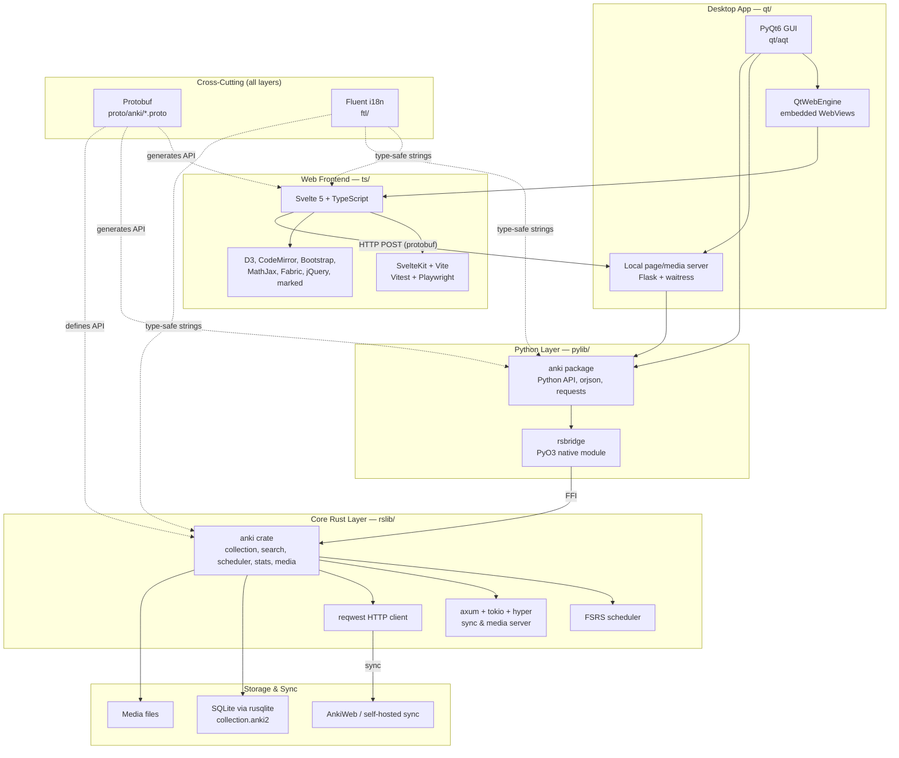
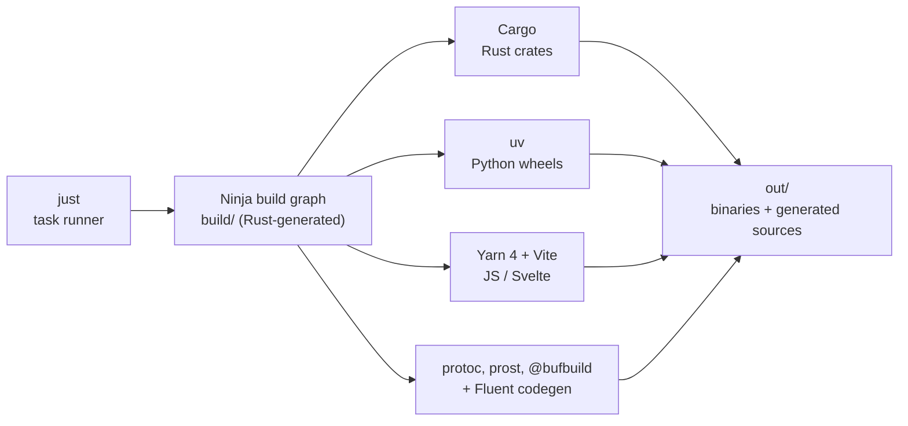

# Anki Architecture

## Tech Stack Overview

Anki is a multi-layered, polyglot application. A core **Rust** library holds most of
the logic; a **Python** library wraps it and powers the **PyQt6** desktop GUI; and a
**Svelte/TypeScript** web frontend renders the card/review/editor UI inside embedded
webviews. **Protobuf** defines the cross-language API/IPC, and **Fluent** provides
type-safe translations to every layer.

### Build & Tooling

The build is driven by `just` recipes wrapping a Rust-generated Ninja build graph,
which orchestrates the per-language package managers and code generators.

### How the Layers Communicate

- **Qt GUI -> Python**: `qt/aqt` (PyQt6 + QtWebEngine) calls the `pylib/anki` Python
  API directly.
- **Python -> Rust**: `pylib/rsbridge` is a PyO3 `cdylib` that exposes the Rust core
  (`rslib`) to Python via FFI.
- **Web frontend -> backend**: Svelte pages run inside QtWebEngine and send
  protobuf-encoded HTTP POST requests to the local server, which routes into the Rust
  core.
- **Protobuf** (`proto/anki/*.proto`) is the single source of truth for the backend
  API, generating type-safe bindings for Rust (`prost`), Python
  (`protobuf`/`mypy-protobuf`), and TypeScript (`@bufbuild`).
- **Fluent** (`ftl/`) auto-generates type-safe translation APIs for all three
  languages.
- **Sync** is handled in Rust (`rslib/sync`) using `reqwest`, against AnkiWeb or a
  self-hostable `axum` server.

## Backend/GUI

At the highest level, Anki is logically separated into two parts.

A neat visualization of the file layout is available here:
<https://mango-dune-07a8b7110.1.azurestaticapps.net/?repo=ankitects%2Fanki>
(or go to <https://githubnext.com/projects/repo-visualization#explore-for-yourself> and enter `ankitects/anki`).

### Library (rslib & pylib)

The Python library (pylib) exports "backend" methods - opening collections,
fetching and answering cards, and so on. It is used by Anki’s GUI, and can also
be included in command line programs to access Anki decks without the GUI.

The library is accessible in Python with "import anki". Its code lives in
the `pylib/anki/` folder.

These days, the majority of backend logic lives in a Rust library (rslib, located in `rslib/`). Calls to pylib proxy requests to rslib, and return the results.

pylib contains a private Python module called rsbridge (`pylib/rsbridge/`) that wraps the Rust code, making it accessible in Python.

### GUI (aqt & ts)

Anki's _GUI_ is a mix of Qt (via the PyQt Python bindings for Qt), and
TypeScript/HTML/CSS. The Qt code lives in `qt/aqt/`, and is importable in Python
with "import aqt". The web code is split between `qt/aqt/data/web/` and `ts/`,
with the majority of new code being placed in the latter, and copied into the
former at build time.

## Protobuf

Anki uses Protocol Buffers to define backend methods, and the storage format of
some items in a collection file. The definitions live in `proto/anki/`.

The Python/Rust bridge uses them to pass data back and forth, and some of the
TypeScript code also makes use of them, allowing data to be communicated in a
type-safe manner between the different languages.

At the moment, the protobuf is not considered public API. Some pylib methods
expose a protobuf object directly to callers, but when they do so, they use a
type alias, so callers outside pylib should never need to import a generated
\_pb2.py file.

## ReadyMCAT additions (the MCAT fork)

ReadyMCAT layers onto the structure above without replacing any of it. Everything is
either a new, additive module or a small, isolated edit to an upstream file (the
per-file merge-difficulty estimates live in
[readymcat-points-at-stake.md](./readymcat-points-at-stake.md) and
[../ios/README.md](../ios/README.md)). The product rationale is in
[../ReadyMCAT-PRD.md](../ReadyMCAT-PRD.md).

- **Rust core (`rslib/`).** Two additive modules:
  - `rslib/src/points_at_stake/` — a new `ReviewCardOrder::PointsAtStake` review order
    that ranks due cards by `topic_weight × student_weakness` (AAMC exam weight ×
    per-topic weakness aggregated from FSRS recall), with a `ReadyMCAT::struggling` 2×
    ranking boost. The same pass produces the per-topic memory aggregation and the
    outline-coverage map the dashboard reads. It reorders only the in-memory queue, so
    undo and collection integrity are untouched.
  - `rslib/src/diagnostic/` — the first-launch diagnostic scorer and prior-seeding
    (difficulty-aware evidence → beta-binomial shrinkage → hierarchical pooling →
    weakness prior), which seeds points-at-stake ordering and never writes dashboard
    scores.
- **Protobuf (`proto/anki/`).** Each capability is exposed as a **new protobuf
  service** — `PointsAtStakeService` (`points_at_stake.proto`) and `DiagnosticService`
  (`diagnostic.proto`) — regenerating type-safe bindings for every layer.
- **Content pipeline (`readymcat/`).** Section content JSONs under
  `readymcat/content/` are merged/validated by `readymcat/tools/build_question_bank.py`
  into a canonical bank; on first launch `qt/aqt/readymcat_provision.py` builds four
  decks straight into the collection with **zero import** (`ReadyMCAT`,
  `ReadyMCAT::Free Response`, `ReadyMCAT::Passages`, `ReadyMCAT::Passages::CARS` —
  1,075 cards) and drops the sidecars (`taxonomy.json`, `subquestions.json`,
  `diagnostic_quiz.json`) beside it.
- **Front end (`ts/`).** Three input-required reviewers (`ts/reviewer/mcq.ts`,
  `fr.ts` + `fr_grade.ts`, `passage.ts`) plus teach-on-miss (`teach_on_miss.ts` +
  `qt/aqt/reviewer.py`), and three SvelteKit pages: the honest-memory dashboard
  (`ts/routes/readymcat-dashboard/`), the first-launch diagnostic
  (`ts/routes/readymcat-diagnostic/`), and the home/study hub
  (`ts/routes/readymcat-home/`).
- **Qt layer (`qt/aqt/`).** Provisioning, the dashboard/diagnostic windows
  (`readymcat.py`), and the home-hub launcher + routing (`readymcat_home.py`). The
  media server (`mediasrv.py`) registers the three pages and exposes
  `pointsAtStakeQueue`, `getDiagnosticQuiz`, `scoreAndSeedDiagnostic`, and
  `readymcatHomeStatus` (the last a Python-level aggregation backed by the pure
  `readymcat/tools/home_launcher.py`). A launch router opens exactly one of the
  diagnostic (first run only) or the home hub on each launch.
- **iOS companion (`ios/`, `rsios/`).** `rsios` is a thin C-ABI staticlib over the
  shared `Backend`, packaged as `RsiosFFI.xcframework` by `ios/scripts/build-rust.sh`;
  the SwiftUI app runs a real review loop on the shared engine on the Simulator, in the
  engine's **default** queue order (points-at-stake is a desktop-side ordering; two-way
  sync is not built).
