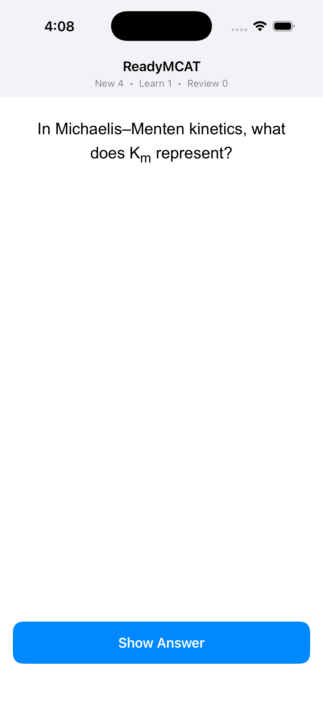

# ReadyMCAT — iOS companion (Wednesday MVP)

A minimal SwiftUI app that runs a **real Anki review session on the shared Rust
engine (`rslib`)** on the iOS Simulator. It loads a bundled `.anki2` collection,
asks the engine for the next due card, renders the card's question/answer HTML in
a `WKWebView`, grades it (Again / Hard / Good / Easy), and continues — exactly
the loop the desktop app runs, but driven from Swift through a thin C interface
instead of Python/PyO3.

There is **no second copy of any engine logic**: Swift calls the same
`Backend::run_service_method(service, method, protobuf_bytes)` dispatch that
`pylib/rsbridge` uses.



## Architecture

```
SwiftUI app (ios/ReadyMCAT)
   │  protobuf bytes  (service idx, method idx, input)
   ▼
RsiosFFI.xcframework  ──►  rsios  (C-ABI staticlib, this repo: /rsios)
   │  #[no_mangle] extern "C"        wraps anki::backend::Backend
   ▼
rslib  (anki crate — the shared Rust engine: scheduler, FSRS, SQLite, rendering)
```

- **`/rsios`** — new thin C-ABI crate (`crate-type = ["staticlib"]`). It mirrors
  `pylib/rsbridge` but exposes a C ABI: `rsios_open_backend`, `rsios_command`,
  `rsios_free_buffer`, `rsios_close_backend`, `rsios_buildhash`
  (see `rsios/include/rsios.h`). `rsios_command` forwards straight to
  `Backend::run_service_method`, so every engine call goes through the identical
  command path the Python bridge uses.
- **`RsiosFFI.xcframework`** — `rslib` + `rsios` cross-compiled for
  `aarch64-apple-ios-sim` and packaged with the C header + clang module map so
  Swift can `import RsiosFFI`.
- **`ios/ReadyMCAT`** — the SwiftUI app. `AnkiEngine.swift` is the Swift side of
  the bridge; `Proto.swift` is a tiny hand-rolled protobuf reader/writer (so we
  need no SwiftProtobuf dependency or `protoc-gen-swift` plugin for the handful
  of messages the review loop uses).

### Review loop & protobuf indices

The app uses these backend service/method indices (taken verbatim from the
generated `out/pylib/anki/_backend_generated.py`, the authoritative index
source, and verified by the host smoke test — see below):

| Call                 | service | method | message                                                           |
| -------------------- | :-----: | :----: | ----------------------------------------------------------------- |
| `OpenCollection`     |    3    |   0    | `collection.OpenCollectionRequest`                                |
| `GetQueuedCards`     |   13    |   3    | `scheduler.GetQueuedCardsRequest` → `QueuedCards`                 |
| `RenderExistingCard` |   27    |   6    | `card_rendering.RenderExistingCardRequest` → `RenderCardResponse` |
| `AnswerCard`         |   13    |   4    | `scheduler.CardAnswer`                                            |

`GetQueuedCards` returns the next card plus its `SchedulingStates`; the app
echoes the relevant state blob back in `CardAnswer.new_state` when grading, so
FSRS schedules the card correctly (no scheduling logic is re-implemented in
Swift).

## Prerequisites

- macOS + Xcode (tested with Xcode 26.4, iOS 26.4 simulator runtime).
- Rust via rustup, plus the simulator target:
  `rustup target add aarch64-apple-ios-sim`.
- `protoc` (Protocol Buffers compiler) for the `rslib` build. Anki's normal
  build downloads it to `out/extracted/protoc/bin/protoc` (the path
  `.cargo/config.toml` points `PROTOC` at). If you build the rest of Anki once,
  it's already there; otherwise install `protobuf` and set `PROTOC`/`PROTOC_BINARY`
  to your `protoc`.

## Build & run

Everything is scripted. From the repo root:

```bash
# 1. Build the Rust engine for the simulator and package the xcframework
ios/scripts/build-rust.sh

# 2a. Build + run on the simulator WITHOUT Xcode (swiftc + simctl)
ios/scripts/run-sim.sh "iPhone 17"           # interactive (then: open -a Simulator)
AUTORUN=1 ios/scripts/run-sim.sh "iPhone 17" # headless self-review + result file
```

Or with Xcode:

```bash
# (after build-rust.sh)
open ios/ReadyMCAT.xcodeproj          # then Run on a simulator, or:
xcodebuild -project ios/ReadyMCAT.xcodeproj -scheme ReadyMCAT \
  -sdk iphonesimulator -destination 'platform=iOS Simulator,name=iPhone 17' build
```

> The `.xcframework` is a large (~100 MB debug) reproducible artifact and is
> git-ignored — run `ios/scripts/build-rust.sh` before opening the project.

### Regenerating the bundled sample deck

`ios/ReadyMCAT/Resources/sample.anki2` (5 MCAT-flavoured Basic cards) is produced
by a host helper that also smoke-tests the FFI review loop end to end:

```bash
cargo run -p sample_deck --release -- ios/ReadyMCAT/Resources/sample.anki2
```

The helper creates the collection with `rslib`'s high-level API, then opens it
through `init_backend` + `run_service_method` and drives
open → get_queued_cards → render → answer_card, asserting the queue drains —
the same path the Swift app uses, so the indices are validated on the host.

## Verified

On the iOS Simulator (iPhone 17, iOS 26.4), the auto-review studied the whole
queue on the shared engine and drained it to zero, e.g.:

```
[ReadyMCAT] copied bundled collection to .../Documents/collection.anki2
[ReadyMCAT] engine opened
[ReadyMCAT][autorun] graded card id=… (1) … (10)
[ReadyMCAT][autorun] AUTO REVIEW DONE: 10 cards graded, 0 remaining
review_result.json -> {"reviewed": 10, "remaining": 0}
```

(5 new cards plus their intraday-learning repetitions — the real FSRS scheduler
re-queues a card after a "Good" on a new card, which is why the graded count
exceeds 5.)

## What works vs. what's stubbed

**Works (Wednesday bar):**

- Cross-compiled `rslib` + `rsios` for the iOS Simulator, packaged as an
  `.xcframework`.
- Real review loop on the shared engine: open collection, get next card, render
  Q/A HTML in `WKWebView`, grade Again/Hard/Good/Easy, advance, finish.
- Bundled `.anki2`, copied into Documents (writable) on first launch.
- Builds with both `xcodebuild` and a plain `swiftc` script; runs on the
  Simulator.

**Out of scope / stubbed for Wednesday (per the PRD):**

- Two-way sync (Friday). `rsios` is built with no TLS backend; the `rustls` /
  `native-tls` cargo features are wired but off.
- Teach-on-miss reviewer (desktop-first).
- Points-at-stake ordering on iOS — the engine change has **landed on `main`**
  (`ReviewCardOrder::PointsAtStake` in `rslib`), so it is compiled into the phone
  binary, but it is **not yet activated here**: the app orders by whatever
  `get_queued_cards` returns (default order), because the bundled `sample.anki2`
  does not select that review order and no `taxonomy.json` is bundled beside it.
  Turning it on is a content/config step (bundle a taxonomy + a collection whose
  deck config selects order 13), not another engine change.
- Device builds / code signing (Simulator-only for Wednesday).
- Media rendering beyond text/HTML (sample deck has no media).

## Upstream files touched (merge-difficulty estimate)

The iOS work is almost entirely **additive** (new `/rsios`, `/ios`,
`/tools/sample_deck`). Edits to existing upstream files are minimal:

| File                   | Change                                                                                        | Merge risk              |
| ---------------------- | --------------------------------------------------------------------------------------------- | ----------------------- |
| `Cargo.toml`           | add `rsios` + `tools/sample_deck` to workspace members                                        | trivial                 |
| `rslib/i18n/gather.rs` | tolerate a missing translation submodule dir instead of panicking (English-only mobile build) | low — 4 lines, isolated |
| `.gitignore`           | ignore iOS build artifacts                                                                    | trivial                 |

`rslib/i18n/gather.rs` is the only behavioural edit, and it only relaxes a
build-time `unwrap()` so the engine compiles without the optional `ftl/*-repo`
translation submodules checked out.

## Notes / known wrinkles

- The debug static lib links a few C objects (sqlite/zstd/blake3) compiled at the
  SDK's default deployment version; `build-rust.sh` pins
  `IPHONEOS_DEPLOYMENT_TARGET=16.0` to keep them aligned and quiet the linker.
- `rsios_buildhash()` returns an empty string in a from-source dev build (the
  build hash isn't stamped); it's wired purely as a "is the engine linked?"
  smoke test.
