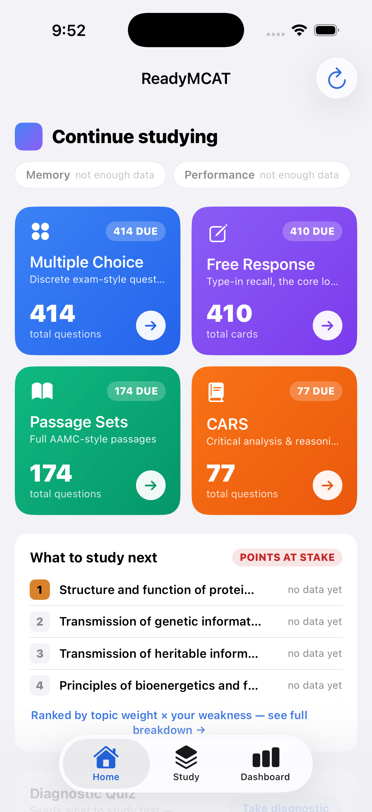

# ReadyMCAT — iOS app (native SwiftUI on the shared Rust engine)

A **native SwiftUI** iOS app that reproduces the ReadyMCAT design on the phone —
Home hub, honest-scores Dashboard, and the MCQ / Free-Response / Passage/CARS
reviewers with teach-on-miss — all backed by the **same Rust engine (`rslib`)**
that powers the desktop app. It is **not** a web view of the desktop UI: every
screen is native SwiftUI, and it talks to the engine through the existing `rsios`
C-ABI FFI using the identical `Backend::run_service_method(service, method,
protobuf_bytes)` dispatch `pylib/rsbridge` uses. There is **no second copy of any
engine logic** — scheduling, FSRS, rendering, the points-at-stake scores, and the
diagnostic all run in the shared Rust core.



## Architecture

```
SwiftUI screens (Home / Study / Dashboard / reviewers / diagnostic)
   │        observe
   ▼
AppModel (opens the collection once; publishes deck tree + points-at-stake)
   │  protobuf bytes  (service idx, method idx, input)   — AnkiEngine.swift
   ▼
RsiosFFI.xcframework  ──►  rsios  (C-ABI staticlib, /rsios)
   │  #[no_mangle] extern "C"        wraps anki::backend::Backend
   ▼
rslib  (the shared Rust engine: scheduler, FSRS, SQLite, rendering,
        PointsAtStakeService, DiagnosticService)
```

### How each SwiftUI screen gets its data

Every screen is driven by a live engine read decoded natively in Swift (a tiny
hand-rolled protobuf reader in `Proto.swift`, extended with `double`/`fixed64`
for the nested score messages — no SwiftProtobuf dependency):

| Screen                               | Engine call (service/method)                                 | Swift decode                                                                                                            |
| ------------------------------------ | ------------------------------------------------------------ | ----------------------------------------------------------------------------------------------------------------------- |
| **Home** tiles (due counts)          | `DeckTree` (7/4) with a non-zero `now`                       | `DeckTree.swift` (child-excluding counters, matching `home_launcher.py`)                                                |
| **Home** score pills + **Dashboard** | `PointsAtStakeQueue` (45/0)                                  | `PointsAtStake.swift` (`MemoryReport`/`CoverageReport`/`PerformanceReport`/`ReadinessReport`/`TopicMastery`)            |
| **Reviewers** — open a format        | `SetCurrentDeck` (7/22) → `GetQueuedCards` (13/3)            | one clean deck per format                                                                                               |
| **Reviewers** — card content         | `GetNote` (25/6) → `Note.fields`                             | `Content.swift` parses the fields (in `build_question_bank.py` order) into typed items + the `Subquestions` JSON ladder |
| **Reviewers** — grade                | `AnswerCard` (13/4) + `AddNoteTags` (49/7)                   | `ReviewSession.swift` (first-try correct → Good; ladder → Again + `ReadyMCAT::struggling`)                              |
| **Diagnostic**                       | `GetDiagnosticQuiz` (29/0) → `ScoreAndSeedDiagnostic` (29/1) | `Diagnostic.swift`                                                                                                      |

Indices are taken verbatim from the generated
`out/pylib/anki/_backend_generated.py` and validated by the host smoke test
(below). The free-response grader (`Grading.swift`) is a faithful Swift port of
`grade_free_response` (normalize / squash / numeric-tolerance / key-term), so the
phone auto-grades type-in answers exactly as the desktop reviewer does.

### The bundled bank

The app ships the **full pre-loaded ReadyMCAT bank** (~1,075 cards). It is built
on the host with the same tooling the desktop uses and bundled into the app; on
first launch the app copies it (plus its companion JSON) into Documents (Anki
opens the collection read-write, and the points-at-stake engine looks for
`taxonomy.json` next to the collection):

```
ios/ReadyMCAT/Resources/
  collection.anki2       # 1,075 cards: MCQ 414 · Free Response 410 · Passages 174 · CARS 77
  taxonomy.json          # tags → 31 AAMC categories (+ weights) — powers the Dashboard
  diagnostic_quiz.json   # one MCQ per AAMC category
  subquestions.json      # curated teach-on-miss ladders (sidecar)
```

`ios/scripts/build-collection.sh` regenerates `collection.anki2`: it runs
`readymcat/tools/build_question_bank.py --collection …` to provision all four
content types, then raises the daily new/review limits, selects
`ReviewCardOrder::PointsAtStake` (order 13), and lays the four formats out as
clean per-format sub-decks (`ReadyMCAT::Multiple Choice`, `::Free Response`,
`::Passages`, `::CARS`) so each Home tile maps 1:1 to a deck. Deck moves never
touch the `#ReadyMCAT::AAMC` tags the dashboard resolves against, so the honest
scores are unchanged.

## AI teach-on-miss ladder generation (server-side proxy)

The bundled bank ships an authored ladder on every card, but an imported deck or
the student's own cards won't have one. For a card with **no authored ladder**,
the phone now generates a short, source-grounded guiding ladder at runtime —
matching the desktop feature — so teach-on-miss works on any deck.

**A faithful Swift port, no Rust change.** `ios/ReadyMCAT/LadderGen.swift` is a
line-for-line port of the desktop source of truth
`readymcat/tools/ladder_gen.py`: the same grounded prompt (`buildMessages`), the
same tolerant `[{q,a}]` parser (`parseLadder`), and the same three deterministic
guardrails with the same constants —

| Guardrail   | Rule                                                     | Constant                |
| ----------- | -------------------------------------------------------- | ----------------------- |
| schema      | 2–4 well-formed `{q,a}` rungs                            | `minRungs=2 maxRungs=4` |
| answer-leak | rung 1 must not restate the answer (lexical containment) | `answerLeakMax=0.7`     |
| grounding   | each sub-answer's content traces to the card's material  | `groundingMin=0.5`      |

The OpenAI key is **not** on the phone. Instead of calling `api.openai.com`
directly, the app POSTs the structured card to a **server-side proxy** (a
Cloudflare Worker — see [`backend/openai-proxy/`](backend/openai-proxy/)) that
holds the OpenAI key as a server secret, builds the identical prompt (model
`gpt-4o-mini`), and returns the raw completion — so the Swift parser + guardrails
run on it unchanged, and no `rsios`/Rust change was needed. The model call
(`ChatFn`, wired to `LadderProxyClient`) is injectable, so the guardrails can be
unit-tested offline:

```bash
ios/scripts/test-laddergen.sh      # compiles LadderGen.swift + the tests on the host, runs them
```

A generated ladder is shown **only** if it clears all three guardrails; otherwise
the reviewer falls back to a normal reveal, exactly as before. It renders through
the existing teach-on-miss reviewer as a **retrieve-before-reveal** step
(`GeneratedLadderView.swift`): the guiding question shows first, the sub-answer is
revealed on tap, and after the last rung the original card is re-asked and graded
(first-try → Good; after-ladder → Again + `ReadyMCAT::struggling`).

**On-device config: a proxy URL + a low-value app token (no OpenAI key).** The
native **Settings** tab holds only a non-secret **Proxy Base URL** and an
optional **app token** sent as `Authorization: Bearer …` (`ProxyConfigStore.swift`).
The OpenAI key never touches the device — it is a server secret in the Worker.
The app token is *low-value*: it only gates who may call your proxy and is
trivially rotated server-side. It is still kept in the **Keychain** (preferred),
with the same `UserDefaults` fallback the unsigned `swiftc` Simulator build needs
(no `application-identifier` entitlement → `errSecMissingEntitlement`) that
`SyncManager` uses for its credentials. Generation is enabled **only** when the
AI toggle is on **and** a proxy URL is set — otherwise the app behaves exactly as
before (authored ladders only).

**Mobile API-key tradeoff — now resolved.** Any key shipped inside a mobile app
can in principle be extracted from a jailbroken/instrumented device. Earlier
builds shipped the OpenAI key on the phone (Keychain) and documented this as an
MVP tradeoff; that key is now **gone from the device entirely** — it lives only
in the server-side proxy. The phone holds just a non-secret URL and a low-value,
easily-rotated app token. Follow-up hardening (rate-limiting, Cloudflare Access,
App Attest) is listed in the [proxy README](backend/openai-proxy/README.md).

**Try it.** First run the proxy locally (`cd ios/backend/openai-proxy && npm
install && npm run dev` — see its [README](backend/openai-proxy/README.md)). Then
in the app: Settings → set **Proxy Base URL** to `http://127.0.0.1:8787` + the
**App token** → toggle **Generate ladders with AI** on → **Save** → **Run AI
ladder demo** seeds one authorless card (deck `ReadyMCAT::AI Demo`, an FR note
with an empty `Subquestions` field) and opens it; answer it wrong to see a ladder
generated live before the answer. The card is seeded through the shared engine
(`NewDeck` 7/0 → `AddDeck` 7/1 → `AddNote` 25/1, reusing the Free-Response
notetype), so it studies through the same native FR path as the real cards. For
the reproducible verification path (no typing), DEBUG builds seed the proxy
config from launch env vars:

```bash
# terminal 1: run the proxy (holds the OpenAI key server-side, from its .dev.vars)
cd ios/backend/openai-proxy && npm install && npm run dev

# terminal 2: launch the app pointed at the local proxy (the Simulator reaches
# the host Mac at 127.0.0.1). The app token matches the proxy's .dev.vars APP_TOKEN.
SIMCTL_CHILD_READYMCAT_PROXY_URL="http://127.0.0.1:8787" \
SIMCTL_CHILD_READYMCAT_APP_TOKEN="<your-dev-app-token>" \
SIMCTL_CHILD_READYMCAT_AI_DEMO=1 \
SIMCTL_CHILD_READYMCAT_REVIEW=demo \
SIMCTL_CHILD_READYMCAT_DEMO=ailadder \
  ios/scripts/run-sim.sh "iPhone 17 Pro"
```

> **ATS (local http).** The Simulator reaching `http://127.0.0.1:8787` is
> cleartext HTTP. iOS permits localhost by default in most cases; if a local run
> is blocked, add `NSAppTransportSecurity → NSAllowsLocalNetworking` to
> `ios/ReadyMCAT/Info.plist` for **dev builds only**. Production `*.workers.dev`
> is HTTPS, so no exception is needed.

Verified live on the Simulator: the authorless card missed → a real ladder
generated (`ladder generation: ok=true attempts=2 schema=true leak=false
grounding=0.67`) and shown before the reveal (`docs/11-ai-teach.png`).

## Prerequisites

- macOS + Xcode (tested with Xcode 26.4, iOS 26.4 simulator runtime).
- Rust via rustup + the simulator target: `rustup target add aarch64-apple-ios-sim`.
- `protoc` for the `rslib` build (Anki's build downloads it to
  `out/extracted/protoc/bin/protoc`; export `PROTOC` to it if building from a
  worktree without `out/`).

## Build & run

```bash
# 1. Build the shared Rust engine for the simulator and package the xcframework.
#    (git-ignored, ~100 MB debug — run this before opening the project.)
PROTOC=/path/to/anki/out/extracted/protoc/bin/protoc PROTOC_BINARY="$PROTOC" \
  ios/scripts/build-rust.sh

# 2. Build + run on the simulator (swiftc + simctl; globs all ios/ReadyMCAT/*.swift).
ios/scripts/run-sim.sh "iPhone 17"
```

Or with Xcode (after `build-rust.sh`): `open ios/ReadyMCAT.xcodeproj` and run on a
simulator (the bundled collection is already in `Resources/`).

### Deterministic launch routing (screenshots / verification)

The app reads a few env vars on launch (pass via `SIMCTL_CHILD_…`), used only for
screenshots and verification:

| Env var                                          | Effect                                                                                                                     |
| ------------------------------------------------ | -------------------------------------------------------------------------------------------------------------------------- |
| `READYMCAT_TAB=study\|dashboard\|sync\|settings` | Start on that tab                                                                                                          |
| `READYMCAT_REVIEW=mcq\|fr\|passage\|cars\|demo`  | Auto-open that reviewer (`demo` = the authorless AI-ladder demo card)                                                      |
| `READYMCAT_DEMO=correct\|wrong\|ailadder`        | Auto-answer the first reviewer question (`ailadder` also auto-advances a miss into the AI ladder, for screenshots)         |
| `READYMCAT_AI_DEMO=1`                            | Seed the authorless demo deck (`ReadyMCAT::AI Demo`) so the AI path is triggerable                                         |
| `READYMCAT_PROXY_URL=http://127.0.0.1:8787`     | **DEBUG only** — pre-fill the proxy base URL so AI generation is on for the test run                                       |
| `READYMCAT_APP_TOKEN=<token>`                   | **DEBUG only** — pre-fill the low-value app token (matches the proxy's `.dev.vars` APP_TOKEN); never committed             |
| `READYMCAT_DIAGNOSTIC=1`                         | Auto-open the diagnostic                                                                                                   |
| `READYMCAT_AUTOPLAY=1`                           | Grade a batch of cards tap-free (grading-path check)                                                                       |
| `READYMCAT_COLLECTION=demo`                      | Open a bundled **synthetic** demo collection to preview a populated dashboard (falls back to the real bank if not bundled) |

## Verified on the iOS Simulator (iPhone 17)

Every screen was run against the bundled real engine data and screenshotted into
`ios/docs/`:

| Screen                                                                   | Screenshot                        |
| ------------------------------------------------------------------------ | --------------------------------- |
| Home hub — 3 score pills + 4 tiles with real due counts (414/410/174/77) | `docs/01-home.png`                |
| Dashboard — honest give-up state (fresh bank)                            | `docs/02-dashboard.png`           |
| Dashboard — populated ranges + confidence (synthetic demo)               | `docs/10-dashboard-populated.png` |
| Study — format picker with live due counts                               | `docs/03-study.png`               |
| MCQ reviewer — tappable options                                          | `docs/04-mcq.png`                 |
| MCQ teach-on-miss — correct/incorrect feedback → guiding questions       | `docs/05-mcq-teach.png`           |
| Free Response — type-in card                                             | `docs/06-fr.png`                  |
| Free Response — auto-graded (model answer + explanation)                 | `docs/07-fr-graded.png`           |
| Passage/CARS — passage panel + question                                  | `docs/08-passage.png`             |
| Diagnostic — one MCQ per AAMC category (31)                              | `docs/09-diagnostic.png`          |
| **AI teach-on-miss — a live-generated guiding ladder (authorless card)** | `docs/11-ai-teach.png`            |

### Host FFI smoke test

`ios/scripts/host-ffi-smoke.py` drives the **exact** rsios dispatch
(`run_service_method` by service/method index) for every engine call the app
makes, on a throwaway copy of the bundled collection, and asserts that grading a
card advances the queue:

```
[1] deck_tree OK: {'ReadyMCAT::Multiple Choice': (414, 414), …}
[2] set_current_deck + get_queued_cards OK: new=414 …
[3] get_note OK: 10 fields; …
[4] answer_card OK: graded Good; new 414 -> 413
[5] points_at_stake OK: coverage 31/31, 31 topics, memory_ready=False
[6] get_diagnostic_quiz OK: present=True, 31 items
HOST FFI SMOKE OK — all native-app engine indices validated.
```

(`tools/sample_deck` — the original Rust host smoke test for the review-loop
indices — is unchanged and still valid.)

## Parity: native on the phone vs. deferred

**Native SwiftUI on the shared engine (verified on the Simulator):**

- Cross-compiled `rslib` + `rsios` for the iOS Simulator, packaged as an
  `.xcframework`.
- Full ~1,075-card bank bundled + copied to Documents on first launch.
- Native **Home hub**: three honest scores, four format tiles with real due
  counts, "what to study next" (points-at-stake), diagnostic entry.
- Native **Dashboard**: Memory / Performance / Readiness as ranges with
  confidence chips and honest give-up states, coverage, and per-topic breakdown —
  decoded from the shared `PointsAtStakeService`.
- Native **reviewers**: MCQ (tappable options with correct/incorrect feedback),
  Free Response (type-in, auto-graded by the ported grader), Passage/CARS
  (passage + question), each with the **teach-on-miss** sub-question ladder, and
  graded through the shared scheduler (Good / Again + struggling tag).
- Native **AI teach-on-miss generation**: for a missed card that has **no
  authored ladder**, a faithful Swift port of the desktop generator
  (`LadderGen.swift`) builds a grounded `{q,a}` ladder via a **server-side proxy**
  (a Cloudflare Worker — no OpenAI key on the phone) and runs the same
  retrieve-before-reveal flow — see below.
- Native **diagnostic**: administers the shared quiz and seeds the ordering prior.
- **Points-at-stake ordering is active** (the bundled collection selects order 13
  with a `taxonomy.json` beside it).
- Native `TabView` navigation (Home · Study · Dashboard).

**Deferred (unchanged from the plan):**

- **Two-way sync** (`rsios` is built with no TLS backend; the feature cargo
  features are wired but off).
- Device builds / code signing (Simulator-only).
- Media rendering beyond text/HTML (the bank is authored as plain text).

## Notes / known wrinkles

- The debug static lib links a few C objects built at the SDK's default
  deployment version; `build-rust.sh` pins `IPHONEOS_DEPLOYMENT_TARGET=16.0`, so
  the linker emits a benign "built for newer iOS-simulator version" warning.
- Card content is authored as plain text, so the reviewers render natively with
  SwiftUI `Text` (no `WKWebView`); a light entity/tag cleanup (`String.plainText`)
  is a safety net.
- `rsios_buildhash()` is empty in a from-source dev build; it is wired purely as
  an "is the engine linked?" smoke test.
